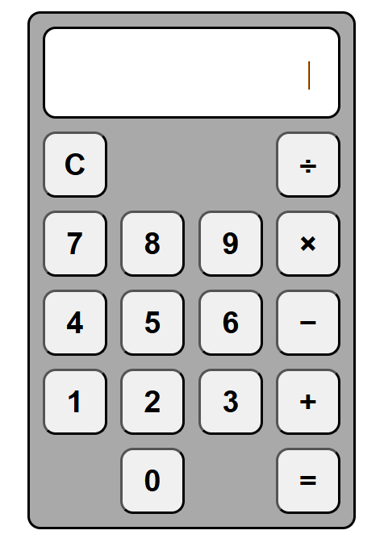

# Odin-Calculator
A basic arithmetic calculator built for _[The Odin Project](https://www.theodinproject.com/about)_

## Examples

## Inspiration
The _[Project: Calculator](https://www.theodinproject.com/lessons/foundations-calculator) (JAVASCRIPT/HTML)_ is part of _[The Odin Project: Foundations](https://www.theodinproject.com/paths/foundations/courses/foundations)_ Course
